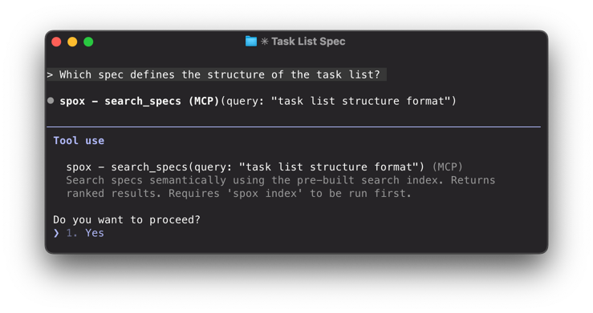
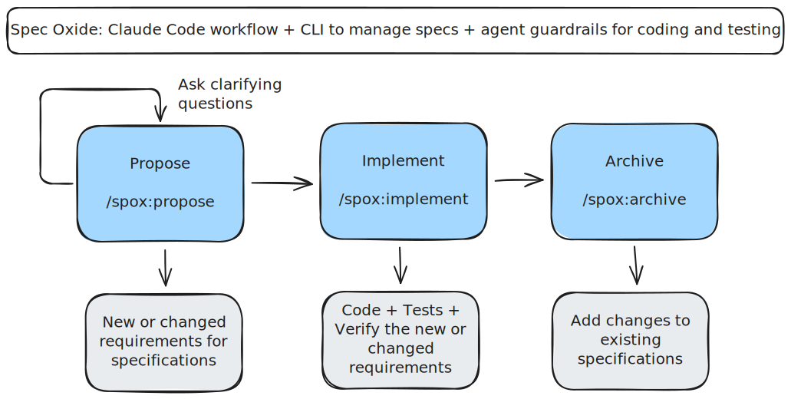

<p align="center">
  
</p>

# Spec Oxide

> Spec-driven development for humans and AI - optimized for Claude Code.

Spec Oxide is a comprehensive workflow and toolset that enables spec-driven development for AI-assisted coding. You
agree on *what* to build before any code is written.

## What do you get?

### 📋 Spec Driven Workflow with three simple commands

**Core principle:** Specs are the source of truth. Changes are proposals that modify that truth.

* `spox:propose` - Propose a change and lock your intent
* `spox:implement` - Implement the defined task list with comprehensive verification
* `spox:archive` - Keep the accepted specs in sync by merging the change proposal

### 🔌 Built-in MCP: agents understand specs and changes

Spec Oxide ships with a built-in MCP server that enables agents to list and search specs.



The built-in MCP server is designed to optimize the context window and minimize token waste.

### 📺 Track Specifications and Changes with a simple CLI

Spec Oxide ships with a simple CLI that helps you manage specs and track changes:


### 🦺 Rules and best-practices preloaded in your context

Spec Oxide maintains an up-to-date `CLAUDE.md` file that includes:

* Proven coding standards for backend, frontend, testing and verification
* Enforcement of test-driven development and clean code practices
* Instructions on how to use the built-in MCP server

## 👋 Get started in minutes—no extra API keys required

For setup and update instructions read the [Setup Guide](docs/setup-guide.md). Setup takes just a couple of minutes.
Besides Claude Code, there are no additional API keys required.

```bash
# Setup
cargo install --git https://github.com/marconae/spec-oxide

# Initialize a new project
spox init

# Run the setup script to configure MCP servers (Serena, Context7)
.spox/setup.sh

# Run Claude Code
claude

# Get started with /spox:setup
```

## Next steps



1. **Read the workflow** — Understand [Propose → Implement → Archive](docs/user-guide.md#workflow)
2. **Edit your mission** — Run `/spox:setup` and define your `specs/mission.md` for your project
3. **Create your first proposal** — Run `/spox:propose` with a real task
4. **Implement your first proposal**  — Run `/spox:implement` and start shipping
   5**Explore the CLI** — See all commands with `spox --help`

Ready to dive deeper? See the full [User Guide](docs/user-guide.md).

## License

See LICENSE file.

## Acknowledgements

Built with ❤️ and Rust!

- **[buildermethods/agent-os](https://github.com/buildermethods/agent-os)** - CC Spec-Driven inspiration
- **[maxritter/claude-codepro](https://github.com/maxritter/claude-codepro)** - CC Spec-Driven inspiration
- **[oraios/serena](https://github.com/oraios/serena)** - MCP for code comprehension
- **[context7/context7](https://github.com/context7/context7)** - MCP for up-to-date docs for external libraries